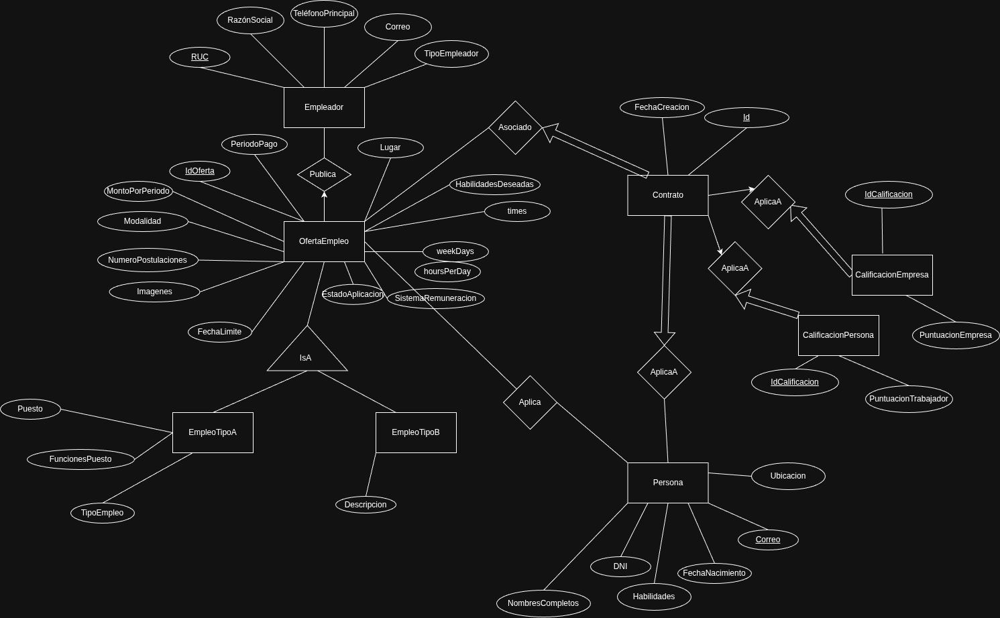

# TrabajoYa - Plataforma de Gestión de Empleos

## Portada

- **Título del Proyecto:** TrabajoYa - Plataforma de Gestión de Empleos
- **Nombre del Curso:** CS 2031 Desarrollo Basado en Plataforma
- **Nombres de los Integrantes:** [Nombres de los integrantes del equipo]

## Índice

1. [Introducción](#introducción)
2. [Identificación del Problema](#identificación-del-problema)
3. [Descripción de la Solución](#descripción-de-la-solución)
4. [Modelo de Entidades](#modelo-de-entidades)
5. [Testing y Manejo de Errores](#testing-y-manejo-de-errores)
6. [Medidas de Seguridad Implementadas](#medidas-de-seguridad-implementadas)
7. [Eventos y Asincronía](#eventos-y-asincronía)
8. [GitHub](#github)
9. [Conclusión](#conclusión)
10. [Apéndices](#apéndices)

## Introducción

### Contexto

TrabajoYa es un sistema de gestión de ofertas de empleo que busca conectar de manera eficiente a empleadores con personas que están en búsqueda de trabajo. La plataforma surge como respuesta a la necesidad de centralizar y simplificar el proceso de búsqueda y contratación de personal en diversos sectores laborales.

### Objetivos del Proyecto

- Facilitar la conexión entre oferentes y demandantes de empleo a través de una plataforma digital centralizada
- Implementar un sistema robusto de gestión de contratos y seguimiento de relaciones laborales
- Proporcionar un mecanismo de calificaciones bidireccionales para fomentar la confianza entre las partes
- Automatizar procesos clave como las notificaciones y el seguimiento de postulaciones

## Identificación del Problema

### Descripción del Problema

El mercado laboral actual se encuentra altamente fragmentado, con múltiples plataformas y medios para la búsqueda y oferta de empleo, lo que dificulta tanto a empleadores como a trabajadores encontrar las oportunidades adecuadas. Esta fragmentación genera:

- Pérdida de tiempo en la búsqueda de candidatos/empleos
- Dificultad para verificar la legitimidad de las ofertas y postulantes
- Falta de seguimiento estructurado de las relaciones laborales
- Comunicación ineficiente entre las partes involucradas

### Justificación

La implementación de una plataforma unificada que simplifique el proceso de contratación es esencial para:

- Reducir los tiempos de búsqueda y contratación
- Aumentar la transparencia en el proceso de contratación
- Facilitar el seguimiento y la gestión de las relaciones laborales
- Promover un ambiente de confianza mediante sistemas de calificación

## Descripción de la Solución

### Funcionalidades Implementadas

1. **Gestión de Ofertas de Empleo**
   - EmpleoA: Ofertas laborales empresariales formales
   - EmpleoB: Servicios domésticos y trabajos temporales
2. **Sistema de Postulaciones y Contratos**

   - Proceso de aplicación estructurado
   - Gestión de contratos digitales
   - Seguimiento de estado de postulaciones

3. **Sistema de Calificaciones Bidireccionales**

   - Calificaciones para empleadores
   - Calificaciones para trabajadores
   - Comentarios y retroalimentación

4. **Notificaciones por Email**
   - Alertas de nuevas postulaciones
   - Notificaciones de cambios de estado
   - Comunicaciones importantes del sistema

### Tecnologías Utilizadas

- **Framework Principal:** Spring Boot 3.4.5
- **Lenguaje:** Java 21
- **Base de Datos:** PostgreSQL
- **Persistencia:** JPA/Hibernate
- **Plantillas:** Thymeleaf
- **Testing:**
  - TestContainers para pruebas de integración
  - JUnit para pruebas unitarias
- **Mapeo de Objetos:** ModelMapper
- **Utilidades:** Lombok
- **Validación:** Jakarta Validation

## Modelo de Entidades

### Diagrama de Clases Principal



### Sistema de Calificaciones

```java
// Calificación para Personas
public class CalificacionPersona {
    private Long id;
    private Persona personaCalificada;
    private Contrato contrato;
    private Double puntuacion;
    private String comentario;
    private LocalDateTime fecha;
}

// Calificación para Empresas
public class CalificacionEmpresa {
    private Long id;
    private Empleador empleadorCalificado;
    private Contrato contrato;
    private Double puntuacion;
    private String comentario;
    private LocalDateTime fecha;
}
```

### Enumeraciones del Sistema

```java
public enum modalidad {
    VIRTUAL,
    PRESENCIAL,
    HIBRIDO
}

public enum SistemaRemuneracion {
    FIJO,
    COMISION,
    MIXTO
}

public enum WeekDays {
    LUNES,
    MARTES,
    MIERCOLES,
    JUEVES,
    VIERNES,
    SABADO,
    DOMINGO
}
```

## Testing y Manejo de Errores

### Estrategia de Testing

#### 1. Tests Unitarios

```java
@ExtendWith(MockitoExtension.class)
public class EmpleoAServiceTest {
    @Mock
    private EmpleoARepository empleoARepository;
    @Mock
    private EmpleadorRepository empleadorRepository;

    @Test
    public void testCreateEmpleoA() {
        // Configuración del test
        when(empleoARepository.save(any(EmpleoA.class))).thenReturn(testEmpleoA);
        when(empleadorRepository.findById(anyString())).thenReturn(Optional.of(testempleador));

        // Ejecución
        EmpleoAResponseDTO result = empleoAService.crearYAsignarEmpleoA(testempleoARequestDTO,"1234");

        // Verificaciones
        assertNotNull(result);
        assertEquals("Av.Juarez", result.getLugar());
        assertEquals("Mensual", result.getPeriodoPago());
    }
}
```

#### 2. Tests de Integración

```java
@DataJpaTest
@Testcontainers
@Import(PostgresTestContainerConfig.class)
@AutoConfigureTestDatabase(replace = AutoConfigureTestDatabase.Replace.NONE)
public class EmpleoARepositoryIntegrationTest {
    @Test
    public void testGuardarYBuscarEmpleoA() {
        // Creación de entidad de prueba
        EmpleoA empleo = new EmpleoA();
        // Configuración de la entidad

        // Prueba de persistencia
        EmpleoA saved = empleoARepository.save(empleo);
        assertThat(saved).isNotNull();

        // Verificación de recuperación
        EmpleoA found = empleoARepository.findById(saved.getIdOfertaEmpleo()).orElse(null);
        assertThat(found).isNotNull();
    }
}
```

## Medidas de Seguridad Implementadas

### Validación de Datos

- Implementación de validaciones robustas utilizando Jakarta Validation
- Verificación de formatos y restricciones en datos de entrada
- Validación de reglas de negocio específicas

### Manejo de Excepciones

```java
@RestControllerAdvice
public class GlobalExceptionHandler {
    @ExceptionHandler(PersonaNotFound.class)
    public ResponseEntity<ErrorMessage> handlePersonaNotFoundException(PersonaNotFound ex) {
        return ResponseEntity.status(HttpStatus.NOT_FOUND)
                           .body(new ErrorMessage(ex.getMessage()));
    }

    @ExceptionHandler(EmpleadorWithTheSameRUC.class)
    public ResponseEntity<ErrorMessage> handleEmpleadorWithTheSameRucException(EmpleadorWithTheSameRUC ex) {
        return ResponseEntity.status(HttpStatus.BAD_REQUEST)
                           .body(new ErrorMessage(ex.getMessage()));
    }
}
```

## Eventos y Asincronía

### Sistema de Notificaciones por Email

```java
@Component
public class EmailListener {
    @Async
    @EventListener
    public void handleEmailEvent(EmailEvent event) {
        // Procesamiento asíncrono de emails
    }
}
```

### Procesamiento Asíncrono

- Manejo asíncrono de calificaciones y retroalimentación
- Procesamiento en segundo plano de tareas no críticas
- Optimización de rendimiento mediante operaciones no bloqueantes

## GitHub

### Estructura del Repositorio

```
├── awsguide.md
├── LICENSE
├── mvnw
├── mvnw.cmd
├── pom.xml
├── README.md
├── src
│   ├── main
│   │   ├── java
│   │   │   └── com
│   │   │       └── purrComplexity
│   │   │           └── TrabajoYa
│   │   │               ├── AplicaA
│   │   │               │   ├── AplicaA.java
│   │   │               │   ├── dto
│   │   │               │   │   ├── CreateAplicaADTO.java
│   │   │               │   │   ├── ResponseAplicaADTO.java
│   │   │               │   │   └── UpdateAplicaADTO.java
│   │   │               │   ├── Repository
│   │   │               │   │   └── AplicaARepository.java
│   │   │               │   └── Service
│   │   │               │       └── AplicaAService.java
│   │   │               ├── AplicaB
│   │   │               │   ├── AplicaB.java
│   │   │               │   └── dto
│   │   │               │       ├── CreateAplicaBDTO.java
│   │   │               │       ├── DeleteAplicaBDTO.java
│   │   │               │       ├── ResponseAplicaBDTO.java
│   │   │               │       └── UpdateAplicaBDTO.java
│   │   │               ├── CalificacionEmpresa
│   │   │               │   ├── CalificacionEmpresa.java
│   │   │               │   ├── CalificacionEmpresaRepository.java
│   │   │               │   ├── dto
│   │   │               │   │   ├── CalificacionEmpresaRequestDTO.java
│   │   │               │   │   └── CalificacionEmpresaResponseDTO.java
│   │   │               │   └── Service
│   │   │               │       └── CalificacionEmpresaService.java
│   │   │               ├── CalificacionPersona
│   │   │               │   ├── CalificacionPersona.java
│   │   │               │   ├── CalificacionPersonaRepository.java
│   │   │               │   ├── dto
│   │   │               │   │   ├── CalificacionPersonaRequestDTO.java
│   │   │               │   │   └── CalificacionPersonaResponseDTO.java
│   │   │               │   ├── Exceptions
│   │   │               │   │   └── TrabajadorNotInContrato.java
│   │   │               │   └── Service
│   │   │               │       └── CalificacionPersonaService.java
│   │   │               ├── Config
│   │   │               │   └── ModelMapperConfig.java
│   │   │               ├── Contrato
│   │   │               │   ├── Contrato.java
│   │   │               │   ├── ContratoRepository.java
│   │   │               │   ├── ContratoServiceImpl.java
│   │   │               │   ├── ContratoService.java
│   │   │               │   ├── dto
│   │   │               │   │   ├── ContratoDTO.java
│   │   │               │   │   ├── CreateContratoDTO.java
│   │   │               │   │   └── UpdateContratoDTO.java
│   │   │               │   └── mapper
│   │   │               │       └── ContratoMapper.java
│   │   │               ├── Controller
│   │   │               │   └── AplicationController.java
│   │   │               ├── email
│   │   │               │   ├── EmailEvent.java
│   │   │               │   ├── EmailListener.java
│   │   │               │   └── EmailService.java
│   │   │               ├── Empleador
│   │   │               │   ├── dto
│   │   │               │   │   ├── EmpleadorRequestDTO.java
│   │   │               │   │   └── EmpleadorResponseDTO.java
│   │   │               │   ├── Empleador.java
│   │   │               │   ├── Exceptions
│   │   │               │   │   ├── EmpleadorNotFound.java
│   │   │               │   │   ├── EmpleadorWithTheSameCorreo.java
│   │   │               │   │   └── EmpleadorWithTheSameRUC.java
│   │   │               │   ├── Repository
│   │   │               │   │   └── EmpleadorRepository.java
│   │   │               │   └── Service
│   │   │               │       └── EmpleadorService.java
│   │   │               ├── EmpleoA
│   │   │               │   ├── dto
│   │   │               │   │   ├── EmpleoARequestDTO.java
│   │   │               │   │   └── EmpleoAResponseDTO.java
│   │   │               │   ├── EmpleoA.java
│   │   │               │   ├── Repository
│   │   │               │   │   └── EmpleoARepository.java
│   │   │               │   └── Service
│   │   │               │       └── EmpleoAService.java
│   │   │               ├── EmpleoB
│   │   │               │   ├── dto
│   │   │               │   │   ├── EmpleoBRequestDTO.java
│   │   │               │   │   └── EmpleoBResponseDTO.java
│   │   │               │   ├── EmpleoB.java
│   │   │               │   ├── Repository
│   │   │               │   │   └── EmpleoBRepository.java
│   │   │               │   └── Service
│   │   │               │       └── EmpleoBService.java
│   │   │               ├── Enum
│   │   │               │   ├── Habilidad.java
│   │   │               │   ├── modalidad.java
│   │   │               │   ├── SistemaRemuneracion.java
│   │   │               │   └── WeekDays.java
│   │   │               ├── exception
│   │   │               │   ├── EmpleoANotFoundException.java
│   │   │               │   ├── EmpleoBNotFoundException.java
│   │   │               │   ├── FutureDateNotAllowedException.java
│   │   │               │   ├── RatingOutOfRangeException.java
│   │   │               │   └── ResourceNotFoundException.java
│   │   │               ├── GlobalExceptionHandler.java
│   │   │               ├── OfertaEmpleo
│   │   │               │   ├── dto
│   │   │               │   │   ├── OfertaEmpleoRequestDTO.java
│   │   │               │   │   └── OfertaEmpleoResponseDTO.java
│   │   │               │   ├── OfertaEmpleo.java
│   │   │               │   ├── Repository
│   │   │               │   │   └── OfertaEmpleoRepository.java
│   │   │               │   └── Service
│   │   │               │       └── OfertaEmpleoService.java
│   │   │               ├── Persona
│   │   │               │   ├── dto
│   │   │               │   │   ├── CreatePersonaDTO.java
│   │   │               │   │   ├── PersonaDTO.java
│   │   │               │   │   ├── PersonaPostulaDTO.java
│   │   │               │   │   └── UpdatePersonaDTO.java
│   │   │               │   ├── Exceptions
│   │   │               │   │   ├── PersonaNotFound.java
│   │   │               │   │   └── PersonaWithSameCorreo.java
│   │   │               │   ├── mapper
│   │   │               │   │   └── PersonaMapper.java
│   │   │               │   ├── Persona.java
│   │   │               │   ├── PersonaRepository.java
│   │   │               │   ├── PersonaServiceImpl.java
│   │   │               │   └── PersonaService.java
│   │   │               └── TrabajoYaApplication.java
│   │   └── resources
│   │       └── application.properties
│   └── test
│       ├── java
│       │   └── com
│       │       └── purrComplexity
│       │           └── TrabajoYa
│       │               ├── config
│       │               │   └── PostgresTestContainerConfig.java
│       │               ├── Contrato
│       │               │   └── ContratoServiceTest.java
│       │               ├── Controlador
│       │               │   └── ControllerTest.java
│       │               ├── Empleador
│       │               │   ├── EmpleadorRepositoryIntegrationTest.java
│       │               │   └── EmpleadorServiceTest.java
│       │               ├── EmpleoA
│       │               │   ├── EmpleoARepositoryIntegrationTest.java
│       │               │   └── EmpleoAServiceTest.java
│       │               ├── EmpleoB
│       │               │   └── EmpleoBServiceTest.java
│       │               ├── Persona
│       │               │   └── PersonaServiceTest.java
│       │               ├── TrabajoYaApplicationTests.java
│       │               └── utils
│       │                   └── Reader.java
│       └── resources
│           ├── application.properties
│           ├── Empleador
│           │   └── post.json
│           ├── EmpleoA
│           │   └── post.json
│           ├── EmpleoB
│           │   └── post.json
│           └── Persona
                └── post.json
```

### Uso de GitHub Projects

- **Organización de Tareas**
  - Utilización de GitHub Projects para la gestión ágil del proyecto
  - Creación y asignación de issues para cada funcionalidad
  - Seguimiento de progreso mediante tableros Kanban
  - Establecimiento de deadlines para cada tarea

### Flujo de Trabajo

1. **Desarrollo de Features**

   - Creación de branches por funcionalidad
   - Convención de nombres: `feature/nombre-funcionalidad`
   - Pull requests con revisión de código
   - Merge a main después de aprobación

2. **Issues y Milestones**

   - Issues detallados con descripción y criterios de aceptación
   - Asignación de responsables y etiquetas
   - Agrupación en milestones para seguimiento de releases

3. **Integración Continua**
   - Automatización de build y tests
   - Verificación de calidad de código
   - Despliegue automático en ambientes de desarrollo

## Conclusión

### Logros del Proyecto

- Implementación exitosa de un sistema completo de gestión de empleos
- Desarrollo de una arquitectura escalable y mantenible
- Integración efectiva de múltiples tecnologías modernas

### Aprendizajes Clave

- Aplicación práctica de patrones de diseño en Spring Boot
- Implementación de pruebas automatizadas
- Gestión de bases de datos relacionales en aplicaciones empresariales

### Trabajo Futuro

- Implementación de autenticación y autorización
- Mejoras en el sistema de calificaciones
- Integración con plataformas de pago
- Desarrollo de aplicación móvil

## Apéndices

### Licencia

Este proyecto está licenciado bajo la Licencia GPL. Consulta el archivo [LICENSE](LICENSE) para más detalles.

### Referencias

- [Spring Boot Documentation](https://docs.spring.io/spring-boot/docs/current/reference/html/)
- [Spring Data JPA](https://docs.spring.io/spring-data/jpa/docs/current/reference/html/)
- [TestContainers for Java](https://www.testcontainers.org/)
